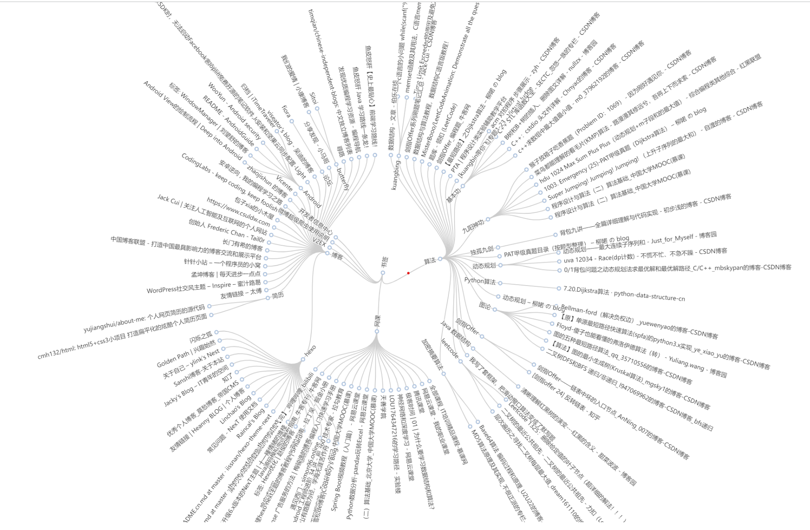
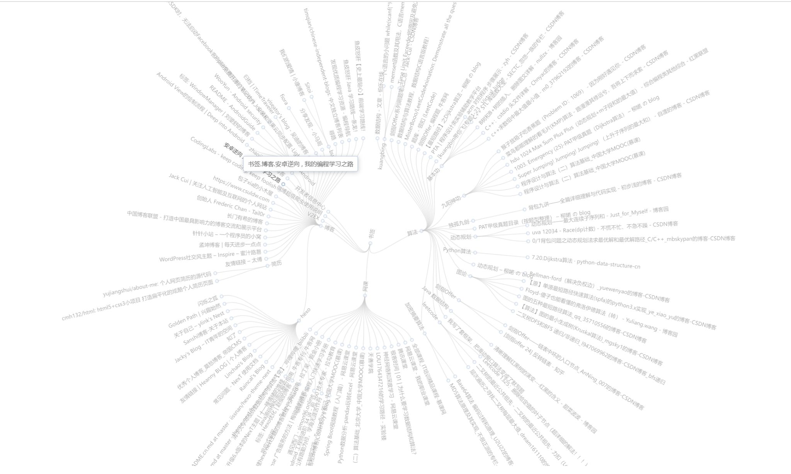

# 浏览器书签可视化项目

Chrome BookMark Visual Project

as well as FireFox, Microsoft Edge

完成这个 mini-project 的初衷是书签太多，层次深，无法直观触达
故可视化之，项目的**叶子节点可以直接点击打开书签**。

## Chrome 扩展

对应的 chrome 扩展已上线 Chrome 应用商店，在线安装即可，无需配置，体验地址，求个好评

[https://chrome.google.com/webstore/detail/bookmarktree/obhnldggnjdmbmidjkjjnlclooehbngf?hl=zh-CN](https://chrome.google.com/webstore/detail/bookmarktree/obhnldggnjdmbmidjkjjnlclooehbngf?hl=zh-CN)

**插件的源代码在本项目的 chrome-extension-src 文件夹下**

## 可视化效果

全景图: 

选中叶子节点可点击直达书签的地址：

## 运行环境
python 3.6.6 及 python3.6.6+

## 运行步骤
1.  `git clone git@github.com:inspurer/ChromeBookmarkVisual.git`

2.  `pip install requirements.txt`

3.  在浏览器中将收藏的书签导出为 html，命名为 `bookmarks.html`

4.  运行 `parse_bookmark_html_to_json.py` 得到 `bookmarks.json`

5.  在 Pycharm 中选择浏览器打开 `tree-radial.html`，即可看到可视化效果，并可点击叶子节点；**注意不要直接在文件夹中打开这个 html，会被 CROS 拦住 json 文件无法加载**

过程可以参考B站对应视频：[Chrome 浏览器书签层次可视化
](https://www.bilibili.com/video/BV1JY411p7f2)

## 个性配置

1. 可在 `parse_bookmark_html_to_json.py` 文件中 `exclude_collection` 变量中添加不需要可视化的根书签收藏夹。

2. 可在 `tree-radial.html` 中 `myChart.setOption` 设置图表样式，如 `layout = orthogonal` 可设置成层次树状图，
   `initialTreeDepth` 可以设置初始最大层数。

## 参考

[使用ECharts绘制网址径向树状图](https://www.cnblogs.com/rustfisher/p/15219690.html)

## 其他

转载引用本项目中的代码，请注明来源
